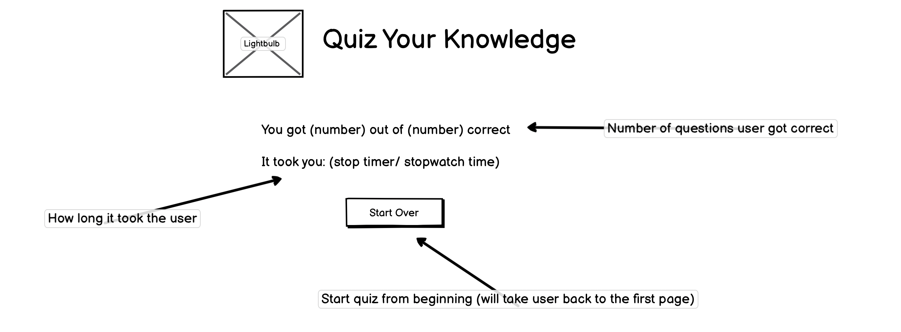
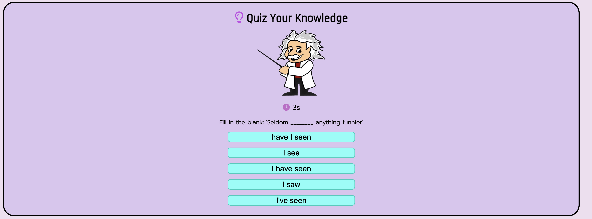
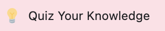

<!-- 
Credits 

https://codepen.io/gcarino/details/AaJBOo - although used this idea and followed along with the code, i did change it up and added my own things to it, I liked the idea however i didnt feel confident to create it on my own and needed the extra support. I did find a lot of struggles with this langauge because of all the math-like code and I have always struggled with maths, but I am confident the more I do and practise the easier it will become and I will understand it. - styled the css on my own - mainly used the JS part and the inital layout for the html for an idea on how to set it out. the rest i redesigned to my liking. - didnt end up using - DID NOT USE
https://stock.adobe.com/uk/Library/urn:aaid:sc:EU:a7e14fc3-e0ae-4d3e-813d-3ee277117c3a?asset_id=214500542 - used my adobe account for this, as there was a free trail 
https://blog.hubspot.com/website/center-an-image-in-html#:~:text=Step%201%3A%20Wrap%20the%20image,to%20a%20fixed%20length%20value. - wanted to use a different methid to center the image rather than using margins
https://www.tutorialspoint.com/html/html_email_links.htm adding email link
favicon - https://favicon.io/emoji-favicons/light-bulb
https://github.com/Code-Institute-Solutions/love-maths-2.0-sourcecode - lovemaths source code for the dom eventlisteners, the score count
https://www.myenglishteacher.eu/blog/english-quiz-questions-and-answers/ - for some question ideas for the english section
https://www.youtube.com/watch?v=riDzcEQbX6k - for help making the buttons functional due to having struggles, then implemented the code to final two buttons myself - used a lot of to help
https://imagecolorpicker.com/color-code/736b76 - for checking colour contrast and choosing the colours
https://www.freecodecamp.org/news/location-reload-method-how-to-reload-a-page-in-javascript/ - create a reload the page button tot take back to. main oage
https://fontawesome.com/
https://fonts.google.com/
https://www.youtube.com/watch?v=WiLTsxjCmWQ to create countdown - however changed to timer
https://stackoverflow.com/questions/41632942/how-to-measure-time-elapsed-on-javascript - create calculate time function
https://stackoverflow.com/questions/61733331/js-power-sign-exponent-to-number - just to get the power numbers to add to the string rather than using the ^ sign

-->

# **Quiz Your Knowledge**

## **Introduction**

Quiz Your Knowledge is an online quiz made using JavaScript that contains various questions that tests the users knowledge across different categories such as: Science, Computer Coding, Spelling/English, History and Geography.

The quiz is currently aimed for secondary school children and higher as some of the questions can be difficult for younger children, but this doesn't stop them from wanting to have a go and try to answer the questions. 

In the future Quiz Your Knowledge hopes to expand and have a vareity of trivia and catagories aimed for everyone to enjoy and be able to participate in. 

 

## **Table of Contents**

<a href="#personal-comments">Personal Comments</a>

<ul>
<li>Creators Comments</li>
</ul>

<a href=#inital-design>Initial Design</a>

<ul>
<li>Wireframe</li>
<ul>
<li>Main Page</li>
<li>Question Page</li>
<li>Score Page</li>
</ui>
</ul>

<a href="#features">Features</a>

<ul>

<a href="#existing-features">Existing Features</a>

<li>Title and Main Image</li>
<li>Introduction</li>
<li>Quiz Container</li>
<li>Buttons and Alerts</li>
<li>Stopwatch</li>
<li>Score Page</li>
<li>Footer</li>
<li>Favicon</li>

<a href="#features-left-to-implement">Features Left to Implement</a>

<li>Back Button</li>
<li>Quiz Categories</li>
<li>Quiz Types</li>
<li>Progress Bar</li>
<li>High Scores</li>
</ul>

<a href= "#testing">Testing</a>

<ul>

<a href="#validator-testing">Validator Testing</a>

<li>HTML</li>
<li>CSS</li>
<li>JavaScript</li>

<a href="#unfixed-bugs">Unfixed Bugs</a>

<li></li>
<li></li>
<li></li>

<a href="#lighthouse">Lighthouse</a>

<li></li>

<a href="#responsiveness">Responsiveness</a>

<li>Desktop</li>
<li>Laptop</li>
<li>Tablet</li>
<li>Mobile</li>
<li>Future Integrations</li>
</ul>

<a href="#deployment">Deployment</a>

<ul>
<li>GitHub Pages</li>
</ul>

<a href="#testimonials">Testimonials</a>

<ul>
<li>User Testimonials</li>
</ul>

<a href="#credits">Credits</a>

<ul>
<li>Images</li>
<li>Content</li>
</ul>

 

## **Personal Comments**

In this section, I will dicuss some of my personal thoughts about the creation of the project and my thoughts on using Javascript, and some of the changes I made during the process.

### ***Creators Comments***

* Although I did find it fun creating the quiz when it eventually worked, there were many struggles and frustrations when things weren't going the way I wanted or planned. When code wasn't working the way I intended and having to change some of my ideas when actually implementing the quiz.
* Initially I wanted to do radio buttons but I couldn't seem to get it to work the way I wanted it to so I decided to change this plan, this inital plan can be seen in the <a href=#inital-design>Inital Design</a> section. 
* Another plan that I had to change was the original score count. I initally did not want to reveal the correct answer, as I wanted to add this as a future implementation, but as the score was not imcrementing the way I intended, I decided to reveal the correct answer so that it would increment the way needed to reveal the score at the end.
* I had many frustrations duting the creation of this project and the code I had originally worked on, was not going the way.I inteneded when trying to get it to display the answers correctly, and due to the timeframe of the project being due, and my frustrations, I had decided to remove that code and start again, testing a different way from a tutorial video, which is referenced in the <a href="#credits">Credits</a>. During this project I have relied a lot on outside help due to struggling a lot and getting frustrated and stressed over a lot of things, however there were a few wins during the project.
* Overall, I did enjoy certain aspects of creating the quiz, there was most certainly a lot of stresses and frustrations, and even moments of wanting to give up completely. 

 

## **Inital Design**

Before starting Quiz Your Knowledge, I used the wireframe tool known as [Balsamiq](https://balsamiq.com/) to create a draft idea of how I wanted the quiz to look and what would happen for each function. Although I did mostly stick to the wireframe, some design changes were made during implementing the quiz due code not functioning as expected or wanting to change the design.

I did not use colours, fonts, images in the wireframe as I was unsure on what I wanted at the time and decided this during creating the quiz.

### ***Wireframes***
#### Main Page
* This was the inital design for the main page of the quiz, there was not much of a different from the draft design compared with the implemented design. One of the main differeces is the decription of the quiz, this was edited for implementation of the quiz, apart from those few changes the design from the wireframe and the finished product remains the same.

Wireframe for Main Page:

#### Question Page
* This was the inital design design for the question page for the quiz. The main difference is that rather than radio buttons being used for the quiz, standard select buttons were used instead. The reason for this was because the radio buttons were not functioning the way it was intended too and not appearing the way it should.
* The next and back buttons both work the way I intended, however instead of having them appear right away, they only appear once an answer has been selected...
<!-- Did alert work if answer not selected? is this needed if you only see answer when its been selected and highlighted when wrong.right -->
* The question shown in the wireframe appeared in the quiz, however the answers were different.
* I also deicded to keep the footer present on the page, rather than hide it.

Wireframe for Question Page:

#### Score Page
* This was the inital design for the score page for the quiz. There is not much of a difference from the inital wireframe and the finished design. The only thing is that the footer remained present throughout.

Wireframe for Score Page:

## **Features**

In this section I will discuss and go through the features that I implemented Quiz Your Knowledge, including the features I would like to include and implement in the future for the quiz.

All the fonts used for the quiz were chosen using [Google Fonts](https://fonts.google.com/) and maintained throughout the quiz, including fallback fonts incase the browser being used does not support the chosen font.

### ***Exisiting Features***

#### Title and Main Image
* The title of the quiz is "Quiz Your Knowledge" and contains a [Font Awesome](https://fontawesome.com/) light bulb icon, which pulsates/beats - this is functionable across the different pages throughout the quiz and with responsiveness on different displays, and the title is displayed throughout the whole quiz.
* The image used for the quiz is the well-known Physics legend Albert Einstein (also a question about him also appears in the quiz). The image was taken from the stock images avaliable through [Adobe](https://stock.adobe.com/uk/) - the main image is also displayed throughout the quiz

#### Introduction
* The introduction section introduces the quiz - including the cataegories that will be included in the quiz, which are: Science, Computer Coding, Spelling/English, History and Geography. The reason I went for a mix of catagories was to have a variety of questions from a mix of topics, rather than focusing on one category.
* This section also encourages users to try and guess the answer, even if they don't know it - at least that way they will have tried. The user will also be scored a point for each question, which will be revealed at the end of the quiz.
* This section also lets users know that there will be a stopwatch feature in the quiz that is timing how long it takes the user to get through the quiz, which will be revealed at the the end of the quiz along with the scores. 
* There is also a final note that lets users know that stopwatch feature will commence when they go into the quiz.

#### Quiz Container
* The Quiz Container is the section that holds the questions and answers for the quiz, which will refresh each time the next button is pressed.
* When going into the quiz container the introduction will disappear from the display to reveal the questions and answer buttons, as well as displaying the timer feature, starting a stopwatch going up by seconds to time the user.
<!-- when selecting answer it changes colour - still need to implement -->
* After an answer has been selected the next and back buttons will appear, allowing the user to move onto the next question.

 
<!-- replace image once page functioning correctly  -->

#### Buttons and Alerts
* There are 6 buttons in the quiz that all have different functions, these buttons are:
    * Let's Begin - this button takes users to the start of the quiz and displays the first question, it also removes the main introduction content, and introduces the stopwatch feature for the quiz. This button will then disappear once the quiz begins. 
     
    
    * Answer button - these are the answer buttons that appear for the quiz... 
    <!-- edit this section once code fixed -->
    * Next - this button appears once an answer has been selected, and once clicked will take users to the next question, and then it will be hidden again, until an answer has been selected. This prevents users from skipping questions... 
    <!-- edit this section once code fixed -->
    * Back - this button appears once and answer has been selected, however will throw an alert once clicked. This was done on purpose to show that the quiz is still being implemented. This button will also disappear once the "next" button has been selected and the next question is displayed. 
     <!-- might delete -->
    * Go to Score - this button will only appear once the final question has been answered instead of "next" and "back" and it will take users to the score page, where the final time and score will be displayed. 
    * Start Over - this button will only appear on the score page and when clicked will take the user back to the main page, with the introduction to the quiz. 
* There are 3 alerts that pop up during the quiz, which occur when:
    * When you click the "Let's Begin" button - when you this button and alert will pop up, letting users know that the quiz is about to begin and once they click "ok" the stopwatch will begin and the quiz will have started. 
    * When you click the "Back" button - when clicked this will alert users that this button has not yet been implemented and to check back another time. This feature was purposefully added. 
    * When you click the "Go to Score" button - when clicked this will alert users that the quiz has ended and will display the final score and time it took them to finish the quiz 
    <!-- might delete -->

#### Stopwatch
* This feature appears and starts as soon as the user goes to the question page and starts going up in seconds. The timer icon used for it is also from [Font Awesome](https://fontawesome.com/).
* The timer appears on all the question pages, and then changes for the score page to display the time taken to complete the quiz.

#### Score Page
* The score page is only accessible once the final question has been answered and the "Go to Score" button has been pressed, which will take users to a page that will display the amount of time taken to complete the quiz and how many questions that they got right. 
* There will also be a "Start Over" button that is only available on this page, which will take users back to the main page before the quiz starts.

#### Footer
* The content here appears on all pages, and it lets users know that this page contains Javascript and that it must be enabled for users to continue with the quiz.
* It also informs users that the questions and answers have been checked and are correct.
* There is also an email contact form link for users to send an email with anything questions or queries.
* I have also included a Copyright icon, saying that the quiz was created by myself and the year.

#### Favicon
* A favicon was also included for the quiz, which appears in the tab page when the quiz is opened. 
<!-- check whether it works once deplpoyed -->

### ***Features Left to Implement***

#### Back Button
* Although there is a "Back" button already implemented in the quiz, I want to implement full functionality of the feature, so that users can go back a question... or if changed to home takes users back to home page
<!-- might delete if code doesnt work the way i want and i change it or change to Home  -->

#### Quiz Categories
* A future implementation is being able to choose which quiz category you want, whether it's just a certain topic, or a mix of all questions. 
* To help gain an understanding of other types of cataegories other than the scholar type ones, market research will be taken to see what interests users and what types of questions to include, e.g. Top Charts, Top Rank Football Players, etc.

#### Quiz Types
* As well as having the typical answer box quizzes, another implementation would also include having different types of quizzes such as:
    * Multiple choice
    * IQ Style quizzes
    * Spot the difference
    * Match the pairs
    * Personality quizzes
* As well as a variety of other options, this will also be determined using market research to find out what is popular and what users like.

#### Progress Bar
* Another feature that will be fun to implement is a progress bar for the quizzes so that users can see how far they are into the quiz and how many questions they have left to answer
* Possibly add an animation once they reach the end of the progress bar.

#### High Scores
* Having a high scores function, that can display a users scores for the quiz, which will be stored in the local data
* An option to view the high scores at the main page of the quiz and at the end of the quiz

## **Testing**

### ***Validator Tetsing***

#### HTML Results

#### CSS Results

#### JavaScript Results 

### ***Unfixed Bugs***
ADD SECTIONS IF ANY FROM TESTING
<!-- back button - appears on first question  -->

### ***Lighthouse***

### ***Responsiveness***

#### Desktop

#### Laptop

#### Tablet

#### Mobile

#### Future Integrations

 

## **Deployment**

### ***GitHub Pages***

## **Testimonials**

### ***User Testimonials***

 

## **Credits**

### ***Images***

 

### ***Content***