# **Quiz Your Knowledge**

## **Introduction**

Quiz Your Knowledge is an online quiz made using JavaScript that contains various questions that tests the users knowledge across different categories such as: Science, Computer Coding, Spelling/English, History and Geography.

The quiz is currently aimed for secondary school children and higher as some of the questions can be difficult for younger children, but this doesn't stop them from wanting to have a go and try to answer the questions. 

In the future Quiz Your Knowledge hopes to expand and have a vareity of trivia and categories aimed for everyone to enjoy and be able to participate in. 

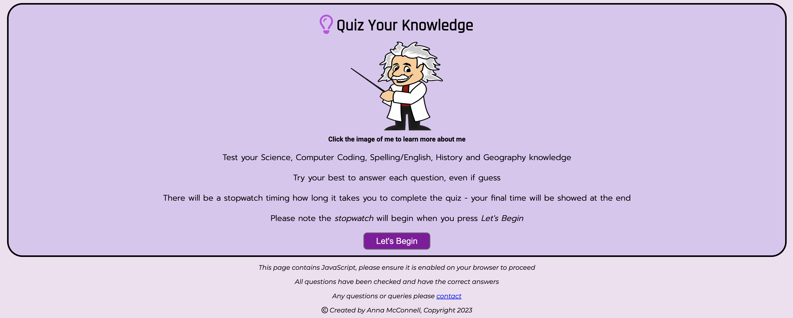

 

## **Table of Contents**

<a href="#personal-comments">Personal Comments</a>

<ul>
<li>Creators Comments</li>
</ul>

<a href=#inital-design>Initial Design</a>

<ul>
<li>Wireframe</li>
<ul>
<li>Main Page</li>
<li>Question Page</li>
<li>Score Page</li>
</ui>
</ul>

<a href="#features">Features</a>

<ul>

<a href="#existing-features">Existing Features</a>

<li>Title and Main Image</li>
<li>Introduction</li>
<li>Quiz Container</li>
<li>Buttons and Alerts</li>
<li>Stopwatch and Score Page</li>
<li>Footer</li>
<li>Favicon</li>

<a href="#features-left-to-implement">Features Left to Implement</a>

<li>Quiz Categories</li>
<li>Quiz Types</li>
<li>Progress Bar</li>
<li>Score Page & High Scores</li>
</ul>

<a href= "#testing">Testing</a>

<ul>

<a href="#validator-testing">Validator Testing</a>

<li>HTML</li>
<li>CSS</li>
<li>JavaScript</li>

<a href="#unfixed-bugs">Unfixed Bugs</a>

<a href="#lighthouse">Lighthouse</a>

<a href="#responsiveness">Responsiveness</a>

<li>Desktop</li>
<li>Laptop</li>
<li>Tablet</li>
<li>Mobile</li>
<li>Future Integrations</li>
</ul>

<a href="#deployment">Deployment</a>

<ul>
<li>GitHub Pages</li>
</ul>

<a href="#testimonials">Testimonials</a>

<ul>
<li>User Testimonials</li>
</ul>

<a href="#credits">Credits</a>

<ul>
<li>Images</li>
<li>Content</li>
</ul>

 

## **Personal Comments**

In this section, I will dicuss some of my personal thoughts about the creation of the project and my thoughts on using Javascript, and some of the changes I made during the process.

### ***Creators Comments***

* Although I did find it fun creating the quiz when it eventually worked, there were many struggles and frustrations when things weren't going the way I wanted or planned. When code wasn't working the way I intended and having to change some of my ideas when actually implementing the quiz.
* Initially I wanted to do radio buttons but I couldn't seem to get it to work the way I wanted it to so I decided to change this plan, this inital plan can be seen in the <a href=#inital-design>Inital Design</a> section. 
* Another plan that I had to change was the original score count. I initally did not want to reveal the correct answer, as I wanted to add this as a future implementation, but as the score was not imcrementing the way I intended, I decided to reveal the correct answer and remove the score count as I could not get it to function correctly, and it was making me get more frustrated - once I get more comfortable and confident with the language I would like to try implementing this again.
* I had many frustrations during the creation of this project, and the code I had originally worked on was not going the way I intended when trying to get it to display the answers correctly, and due to the timeframe of the project being due, and my frustrations, I had decided to remove that code and start again, testing a different way from a tutorial video, which is referenced in the <a href="#credits">Credits</a>. During this project I have relied a lot on outside help due to struggling a lot and getting frustrated and stressed over a lot of things, however there were a few wins during the project.
* Overall, I did enjoy certain aspects of creating the quiz, there was most certainly a lot of stresses and frustrations, and even moments of wanting to give up completely. But I believe once I am more comfortable and confident with the language it will become easier for me to understand and use without getting frustrated.

 

## **Inital Design**

Before starting Quiz Your Knowledge, I used the wireframe tool known as [Balsamiq](https://balsamiq.com/) to create a draft idea of how I wanted the quiz to look and what would happen for each function. Although I did mostly stick to the wireframe, some design changes were made during implementing the quiz due code not functioning as expected or wanting to change the design.

I did not use colours, fonts, images in the wireframe as I was unsure on what I wanted at the time and decided this during creating the quiz.

### ***Wireframes***
#### Main Page
* This was the inital design for the main page of the quiz, there was not much of a difference from the draft design compared with the implemented design. One of the main differeces is the decription of the quiz, this was edited for implementation of the quiz, apart from those few changes the design from the wireframe and the finished product remains the same.
* I did decide to make the image clickable on the homepage, so that a small "about me" alert comes up when clicked that tells the user more about Albert Einstein, however once the quiz begins, you can no longer click on him.

Wireframe for Main Page:
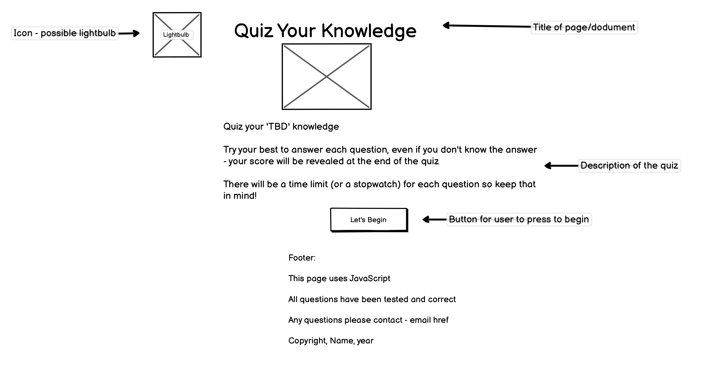

#### Question Page
* This was the inital design design for the question page for the quiz. The main difference is that rather than radio buttons being used for the quiz, standard select buttons were used instead. The reason for this was because the radio buttons were not functioning the way it was intended too and not appearing the way it should.
* The "Next" button worked how I intended, however instead of having it appear right away, it would appear once and answer had been selected. The "Next" button disappears after each new question displays.
* Rather than having a "Back" button, I changed it to a "Home" button as I decided to have the answers change colour whether the user selected the correct or incorrect one. This button is visable throghout all the questions, however when a user clicks on it, an alert pops up, this is an intential design function.
* The question shown in the wireframe appeared in the quiz, however the answers were different.
* I also deicded to keep the footer present on the page, rather than hide it.

Wireframe for Question Page:
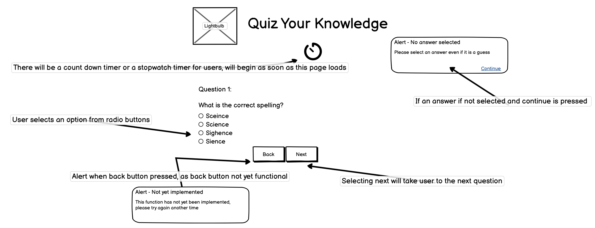

#### Score Page
* This was the inital design for the score page for the quiz. Rather than having a score displayed on this page, it only shows how long it took the user to complete the quiz. The reason for this was being unable to implement the score counter correctly and running out of time.
* The "Start Over" button will only appear on this page and takes users back to the main page.

Wireframe for Score Page:
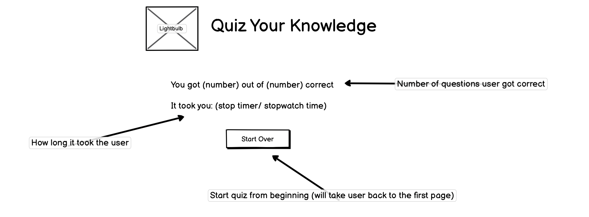

 

## **Features**

In this section I will discuss and go through the features that I implemented Quiz Your Knowledge, including the features I would like to include and implement in the future for the quiz.

All the fonts used for the quiz were chosen using [Google Fonts](https://fonts.google.com/) and maintained throughout the quiz, including fallback fonts incase the browser being used does not support the chosen font.

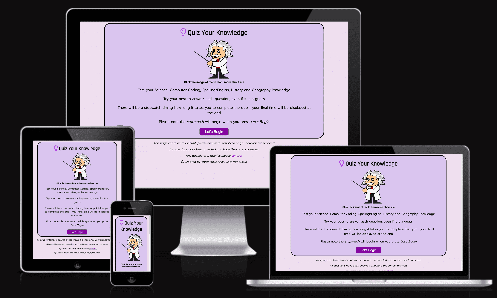

### ***Exisiting Features***

#### Title and Main Image
* The title of the quiz is "Quiz Your Knowledge" and contains a [Font Awesome](https://fontawesome.com/) light bulb icon, which pulsates/beats - this is functionable across the different pages throughout the quiz and with responsiveness on different displays, and the title is displayed throughout the whole quiz.
* The image used for the quiz is the well-known Physics legend Albert Einstein (also a question about him also appears in the quiz). The image was taken from the stock images avaliable through [Adobe](https://stock.adobe.com/uk/) - the main image is also displayed throughout the quiz
* The image is also clickable, and once a user clicks the image, an alert will pop up showing some "About Me" information about Albert Einstein, however this function will stop working once the quiz begins. The clickable image gives users some more interactivity on the main page.
* There is only one HTML page implemented for this quiz that changes the display with the JavaScript functions.

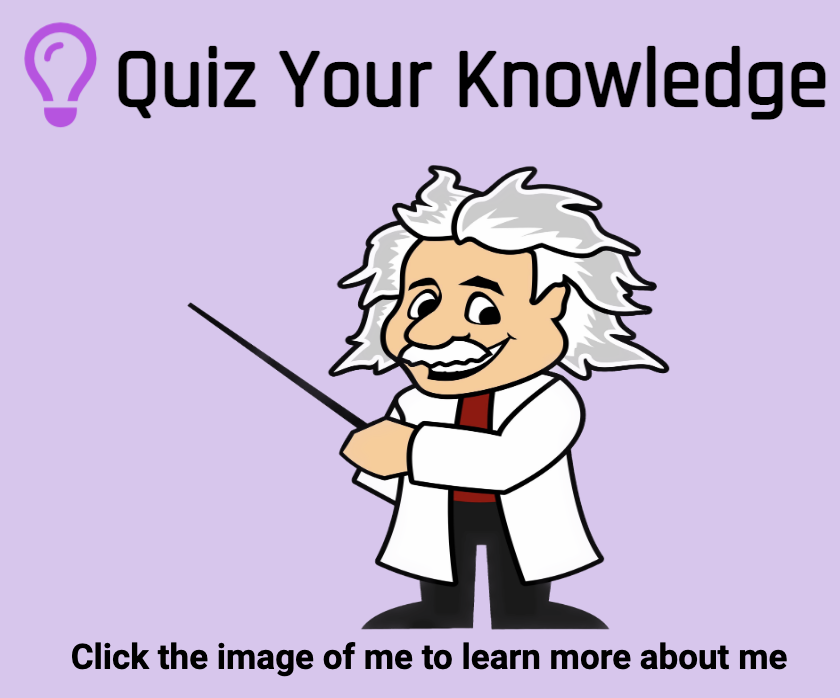

#### Introduction
* The introduction section introduces the quiz - including the cataegories that will be included in the quiz, which are: Science, Computer Coding, Spelling/English, History and Geography. The reason I went for a mix of catagories was to have a variety of questions from a mix of topics, rather than focusing on one category.
* This section also encourages users to try and guess the answer, even if they don't know it - at least that way they will have tried.
* This section also lets users know that there will be a stopwatch feature in the quiz that is timing how long it takes the user to get through the quiz, which will be revealed at the the end of the quiz along with the scores. 
* There is also a final note that lets users know that stopwatch feature will commence when they go into the quiz.

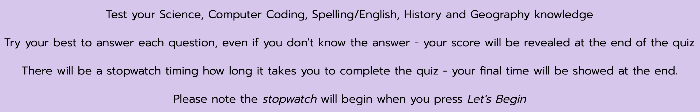

#### Quiz Container
* The Quiz Container is the section that holds the questions and answers for the quiz, which will show the next question each time the "Next" button is pressed.
* When going into the quiz container the introduction will disappear from the display to reveal the questions and answer buttons, as well as displaying the timer feature, starting a stopwatch going up by seconds to time the user.
* After an answer has been selected the "Next" button will appear allow users to move onto the next question, this button will not appear until an answer has been selected, preventing the user to move forward without answering.
* The answers will change colour depending whether the user selected the correct or incorrect answerso that they can learn whether from their mistakes, if any.
* The "Home" button will be visable throughout the actual question portion, however it throws an alert when clicked - this is the function implemented by design.

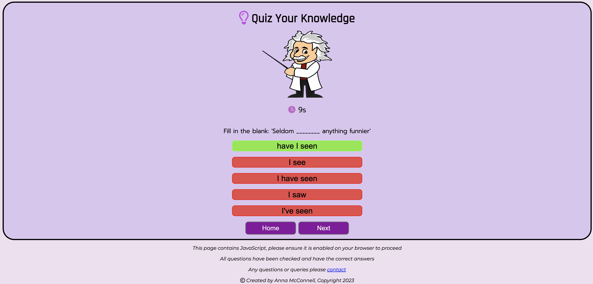

#### Buttons and Alerts
* There are 6 buttons in the quiz that all have different functions, these buttons are:
    * Let's Begin - this button takes users to the start of the quiz and displays the first question, it also removes the main introduction content, and introduces the stopwatch feature for the quiz. This button will then disappear once the quiz begins. 
     
    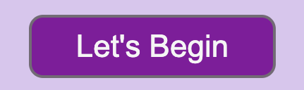
    * Answer button - these are the answer buttons that appear for the quiz, they appear a standard colour, until one has been pressed, then they change colour depending whether the answer was right or wrong  
    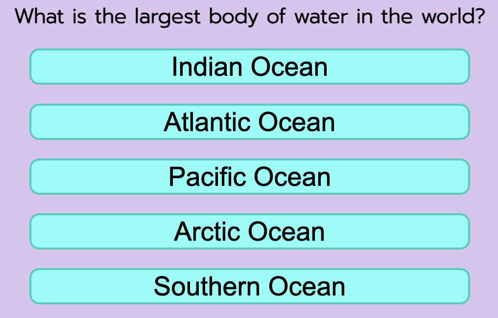
    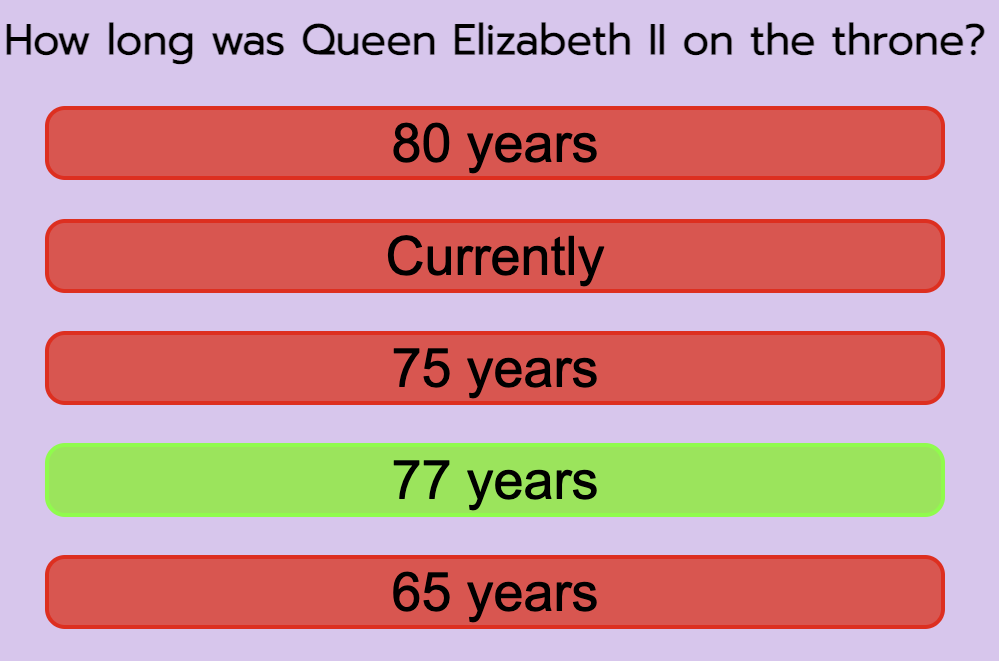
    * Next - this button appears once an answer has been selected, and once clicked will take users to the next question, and then it will be hidden again, until an answer has been selected. This method doesn't allow users to skip to the next question without attempting to answer it.  
     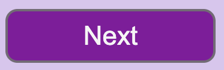
    * Home - This button appears once the quiz begins and will only disappear once the final answer is selected - it will also not be displayed on the score page. This button is however not functional by design, and an alert will pop up once it has been clicked. The purpose of the button when it is functionally is to take users to the main page again. The code may be similar to the "Start Over" button, however the implementation is different when functional.  
    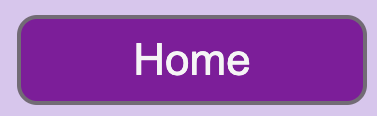
    * Go to Score - this button will only appear once the final question has been answered instead of "Next" and "Home" buttons and it will take users to the score page, where the final time will be displayed.   
    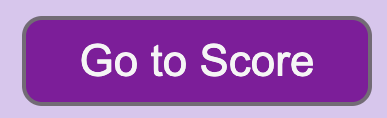
    * Start Over - this button will only appear on the score page and when clicked will take the user back to the main page, with the introduction to the quiz. This is the only button that will show here, it has a similar function to the "Home" button but this one is functionable   
    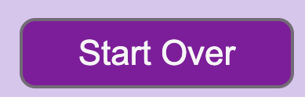
* There are 3 alerts that pop up during the quiz, which occur:
    * When you click the "Let's Begin" button - when clicked this will alert users letting them know that the quiz is about to begin and once they click "ok" the stopwatch will begin and the quiz will have started.  
    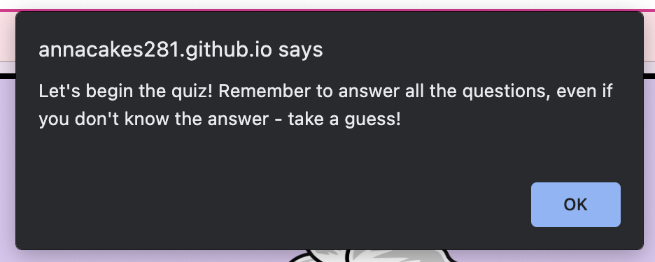
    * When you click the "Home" button - when clicked this will alert users that this button has not yet been implemented and to check back another time. This is a design feature.  
    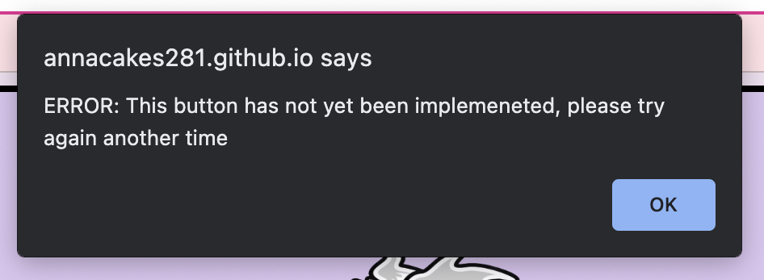
    * When you click the "Albert" Image - when clicked this will give users a small "About Me" feature about Albert Einstein, with some details about him that users may find interesting  
    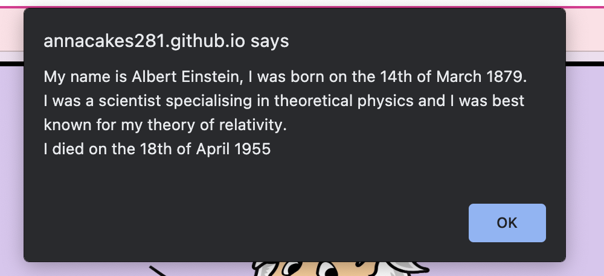

#### Stopwatch and Score Page
* This feature appears and starts as soon as the user goes to the question page and starts going up in seconds. The timer icon used for it is also from [Font Awesome](https://fontawesome.com/).
* The timer appears on all the question pages, and then changes for the score page to display the time taken to complete the quiz.

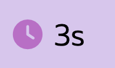

* The score page is only accessible once the final question has been answered and the "Go to Score" button has been pressed, which will take users to a page that will display the amount of time taken to complete the quiz. 
* There will also be a "Start Over" button that is only available on this page, which will take users back to the main page before the quiz starts.

#### Footer
* The content here appears on all pages, and it lets users know that this page contains Javascript and that it must be enabled for users to continue with the quiz.
* It also informs users that the questions and answers have been checked and are correct.
* There is also an email contact form link for users to send an email with anything questions or queries.
* I have also included a Copyright icon, saying that the quiz was created by myself and the year.

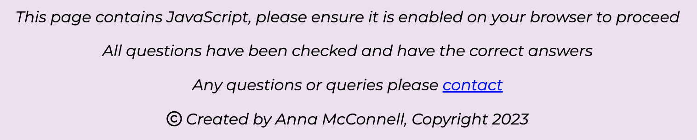

#### Favicon
* A favicon was also included for the quiz, which appears in the tab page when the quiz is opened. 
* This has been checked and works upon deployment (please note that there are image files in the root file, due to this being needed according to the [Favicon](https://favicon.io/emoji-favicons/light-bulb) website where I got the icon).

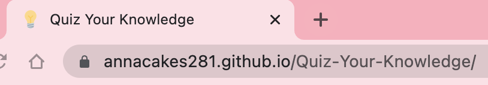

### ***Features Left to Implement***

#### Quiz Categories
* A future implementation is being able to choose which quiz category you want, whether it's just a certain topic, or a mix of all questions. 
* To help gain an understanding of other types of cataegories other than the scholar type ones, market research will be taken to see what interests users and what types of questions to include, e.g. Top Charts, Top Rank Football Players, etc.

#### Quiz Types
* As well as having the typical answer box quizzes, another implementation would also include having different types of quizzes such as:
    * Multiple choice
    * IQ style quizzes
    * Spot the difference
    * Match the pairs
    * Game style quizzes
* As well as a variety of other options, this will also be determined using market research to find out what is popular and what users like.

#### Progress Bar
* Another feature that will be fun to implement is a progress bar for the quizzes so that users can see how far they are into the quiz and how many questions they have left to answer
* Possibly add an animation once they reach the end of the progress bar.

#### Score Page & High Scores
* A function that calculates the score of the user for how many questions they selected correctly, that allows them to see the score at the end of the quiz (I was originally planning to implement this however the code would not work how I planned)
* Having a high scores function, that can display a users scores for the quiz, which will be stored in the local data
* An option to view the high scores at the main page of the quiz and at the end of the quiz

 

## **Testing**

In this section I will discuss the results from using the HTML, CSS and JavaScript validators, any unfixed bugs or errors that appeared within the code, and the results from Lighthouse (avaliable from the dev tools in Google Chrome).

I will also discuss the responsiveness of the Quiz your Knowledge website from different viewports, which were taken from the [Am I Responsive](https://ui.dev/amiresponsive?) website for desktop, laptop, tablet and mobile devices.

### ***Validator Tetsing***
To test my code for bugs and errors, I used the following tools:
* [W3C HTML Validator](https://validator.w3.org/#validate_by_input)
* [W3C CSS Validator](https://jigsaw.w3.org/css-validator/#validate_by_input)
* [JSHint JavaScript Quality Tool](https://jshint.com/)

#### HTML Results
* No errors or warnings appeared on the validator for the HTML code.
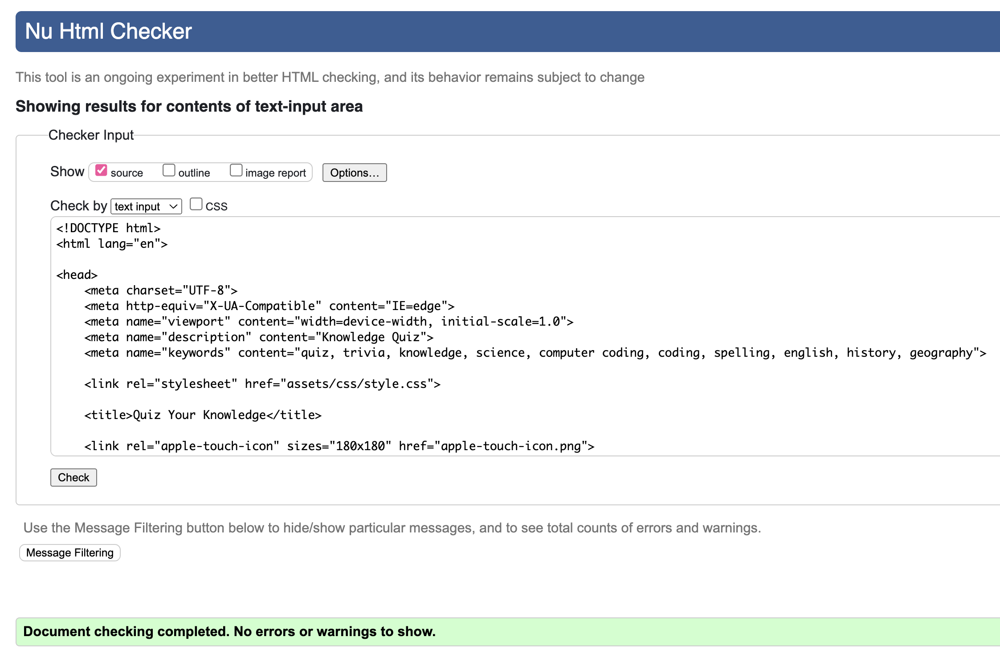

#### CSS Results
* No errors found on the validator for the CSS code.

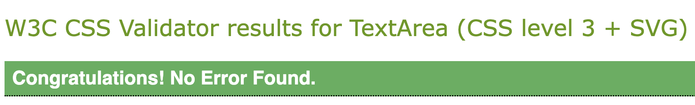

#### JavaScript Results 
* There was 31 warnings shown in the tool, however this was due to using "const" and "let" variables, saying that this feaure is avaliable in ES6 or Mozilla JS. However I tested the quiz using Safari on my phone and Chrome on my desktop and it worked the way it should have.
* It also stated that there were 2 unused variables, however they are used to implement a certain feature.
* No major errors or bugs occur in the JavaScript code and the quiz functions as intended

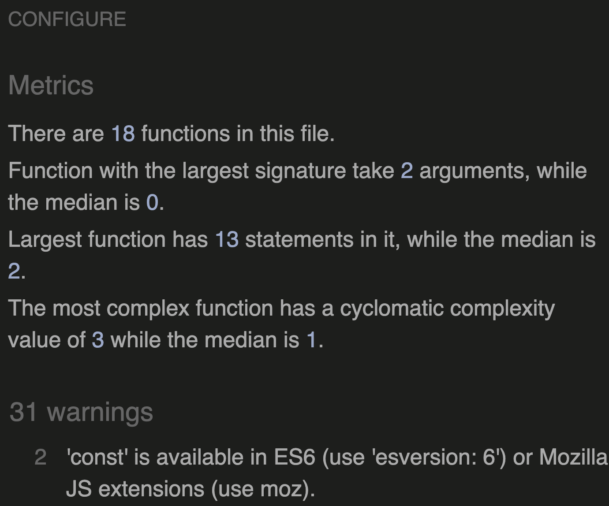
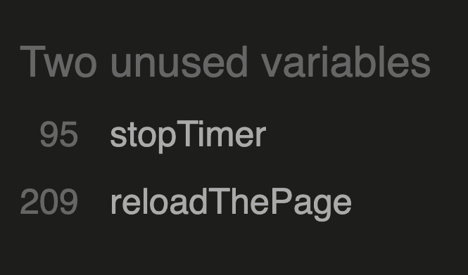

### ***Unfixed Bugs***
* The only "unfixed" bug was implemented as a design feature, when clicking on the "Home" button an alert pops up rather than taking the user back to the home page.
* No other bugs visable.
* The only issue I found which is not really a bug, but more of a display issue was not being able to display one of the questions' answers as subscript in the string. I had tried to figure this out but struggled finding something that would display it the way I intended it to display in the quiz.

### ***Lighthouse***

In this section I will discuss the results from the Lighthouse tool which can be found in the Chrome Dev Tools.

* The scores for the main page for the quiz are all between 92-100 points out of 100.
* These scores are pretty consistent throughout the entire quiz as there is only one HTML page that loads, the display just changes due to the functions of the quiz.

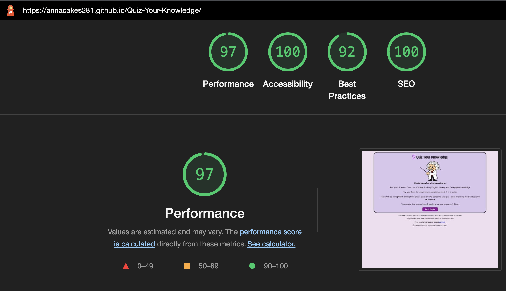

### ***Responsiveness***
To check for responsiveness on different viewports, I used [Am I Responsive](https://ui.dev/amiresponsive?) for my pages, with the reommended viewports that were listed for: desktop, laptop, tablet, and mobile devices.

**The Quiz Your Knowledge site was designed on a screen width of: 1440px** but it does work on larger displays. My main display has a screen width of: 2500px and it functions correctly.

#### Desktop
* All the pages are responsive for a desktop viewport of: 1600px x 922px

#### Laptop
* All pages are responsive for a laptop viewport of: 1280px x 802px

#### Tablet
* All pages are responsive for a tablet viewport of: 768px x 1024px

#### Mobile
* All pages are responsive for a mobile viewport of: 320 x 480px

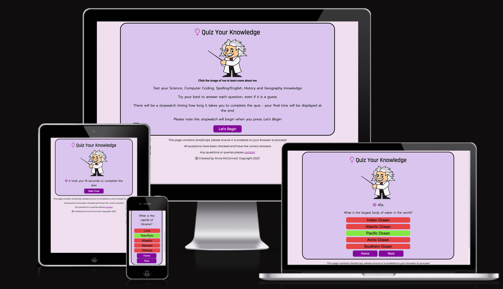

#### Future Integrations
* In the future I want to be able to integrate the quiz to be able to work and display on all types of screen, including the newer designs of phones, as well as screen readers.

 

## **Deployment**
In this section I will explain the process I went through to deploy my quiz website so that it was live. In order for this to happen, I had to use a hosting platform known as Github.

### ***GitHub Pages***
* The site was deployed via GitHub pages, and to do this, I took the following stops:
    * From the GitHub repository within the browser page, go across to the settings tab
    * From there, select the pages option from the choices shown on the right-hand side
    * After this, go the the "Branch" secttion, go to the drop down box, select "main", and then select the "root" file
    * Click "Save", and then after a few minutes, refresh the page, and there will be a URL that you can click that will allow you to access the website.

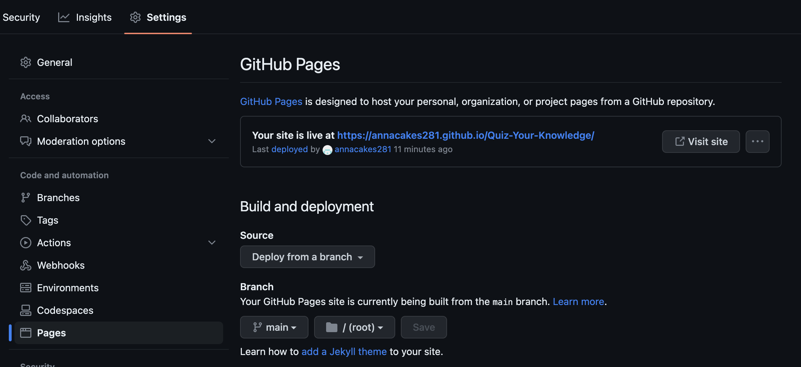

The following is the live link for: [Quiz Your Knowledge](https://annacakes281.github.io/Quiz-Your-Knowledge/)

 

## **Testimonials**
In this section I will discuss some user testimonials I got from asking a few friends and family to test out the quiz and what they thought about it. I do not know anyone of secondary school age, so I did not have a chance to ask anyone from that audience.

**Please note I had asked some of the people in person, during various stages of testing. I did not include full names or screenshots of the conversations for privacy reasons. In future I plan to provide a small survey to be filled in**

### ***User Testimonials***
#### Inga, 48, F
* I found the quiz fun and easy to use despite not being a big fan of technology. I liked being able to see which answers I got right and wrong. It was a good idea to add it. I would have liked to see the score that you mentioned when creating it. Other than that I enjoyed playing your quiz. Well done!
#### Rachael, 27, F
* I found it really cool! It's good, all random questions and I didn't know some of them. Well done on creating it. It will be awesome to see what features you add in the future.
#### Cody, 28, M
* I really liked it. I liked the features and functions you implemented and included! I would have liked to see more vareity of questions, and maybe adding a random function to the answers so they don't display in the same place each time?
#### Barry, 83, M
* I really enjoyed participating in your quiz that you created. It was really fun to do and had very interesting questions. I hope to see you develop this further one day. Good work.

 

## **Credits**
This section will contain all the credits to sites and developers I used to help build my the quiz.
### ***Images***
#### **Adobe Stock Image**
* For the stock image of Albert Einstein I used a stock image provided by [Adobe](https://stock.adobe.com/uk/Library/urn:aaid:sc:EU:a7e14fc3-e0ae-4d3e-813d-3ee277117c3a?asset_id=214500542) - I had a free trial for this software, so I decided to use it.
* [Image Compresser](https://www.img2go.com/compress-image) to compress the image file size.

### ***Content***
#### Tutorials
* To help create the quiz and for help implementing the code to work the way I wanted, I did rely on a couple of video tutorials due to having struggled and getting frustrated, however function names and statements have been changed to suit my quiz. There are functions and features that I did implement on my own from changing code from what I had implemented to suit what I wanted it to do. I would like to credit the original creators for helping me to create my quiz: 
**Main code and Timer**
    * Web Dev Simplified:
        * [Youtube Video](https://www.youtube.com/watch?v=riDzcEQbX6k)
        * [Source Code](https://github.com/WebDevSimplified/JavaScript-Quiz-App/blob/master/script.js)
    * Dear Programmer:
        * [Youtube Video](https://www.youtube.com/watch?v=WiLTsxjCmWQ)
        * No source code attached to video
        * I changed this code to implement a stopwatch feature, rather than a timer for each question

* In order to calcuate the total time taken to complete the quiz, I used the following page from [Stack Overflow](https://stackoverflow.com/questions/41632942/how-to-measure-time-elapsed-on-javascript).
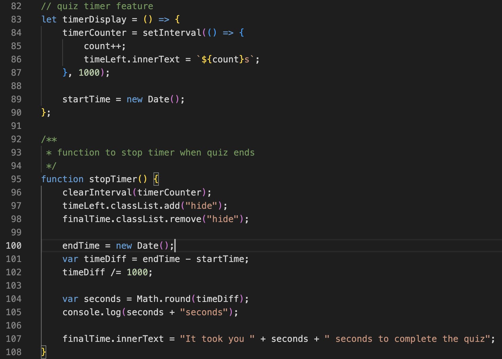
* To create the reload page function when the "Start Over" button was pressed, I used the following page from [Free Code Camp](https://www.freecodecamp.org/news/location-reload-method-how-to-reload-a-page-in-javascript/)
* To insert the power of integer rather than using the ^ symbol, I just copied and pasted the text from [Stack Overflow](https://stackoverflow.com/questions/61733331/js-power-sign-exponent-to-number) page (no code taken from this page).

**Font Awesome, Google Fonts & Favicon**
* The lightbulb and timer icon used in the quiz can be found on [Font Awesome](https://fontawesome.com/).
* The fonts that can be seen displayed in the quiz can be found on [Google Fonts](https://fonts.google.com/).
* The lightbulb favicon can be found on [Favicon](https://favicon.io/emoji-favicons/light-bulb).

**Styling & HTML properties, and Colour Selector**
* To help center the Albert Einstein image to the center of the page, rather than using margins to push the content to the middle, I found a different way to be able to style it on [Hubspot](https://blog.hubspot.com/website/center-an-image-in-html#:~:text=Step%201%3A%20Wrap%20the%20image,to%20a%20fixed%20length%20value.) by using the "Flex" property.
* To add the "Email href" to the HTML code, that allows it to be clickable and opens up the mail application, I used the idea from [Tutorials Point](https://www.tutorialspoint.com/html/html_email_links.htm) to add this into my footer.
* To help select colours and to make sure that the contrast worked with each other, I used the [Image Color Picker](https://imagecolorpicker.com/color-code/736b76).

**Question Idea**
* For one of the English questions in the quiz I took one of the questions from the [My English Teacher](https://www.myenglishteacher.eu/blog/english-quiz-questions-and-answers/) quiz (the other questions I already knew the answers too, I just wanted an extra idea for the English section).