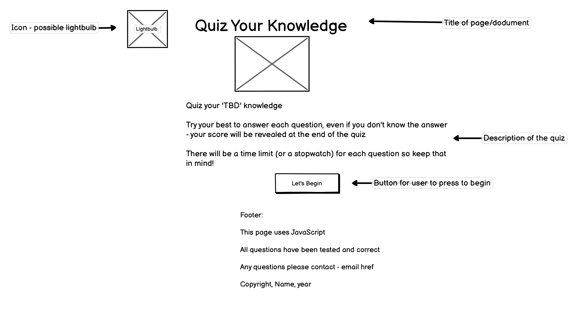

<!-- 
Credits 

https://codepen.io/gcarino/details/AaJBOo - although used this idea and followed along with the code, i did change it up and added my own things to it, I liked the idea however i didnt feel confident to create it on my own and needed the extra support. I did find a lot of struggles with this langauge because of all the math-like code and I have always struggled with maths, but I am confident the more I do and practise the easier it will become and I will understand it. - styled the css on my own - mainly used the JS part and the inital layout for the html for an idea on how to set it out. the rest i redesigned to my liking. - didnt end up using - DID NOT USE
https://stock.adobe.com/uk/Library/urn:aaid:sc:EU:a7e14fc3-e0ae-4d3e-813d-3ee277117c3a?asset_id=214500542 - used my adobe account for this, as there was a free trail 
https://blog.hubspot.com/website/center-an-image-in-html#:~:text=Step%201%3A%20Wrap%20the%20image,to%20a%20fixed%20length%20value. - wanted to use a different methid to center the image rather than using margins
https://www.tutorialspoint.com/html/html_email_links.htm adding email link
favicon - https://favicon.io/emoji-favicons/light-bulb
https://github.com/Code-Institute-Solutions/love-maths-2.0-sourcecode - lovemaths source code for the dom eventlisteners, the score count
https://www.myenglishteacher.eu/blog/english-quiz-questions-and-answers/ - for some question ideas for the english section
https://www.youtube.com/watch?v=riDzcEQbX6k - for help making the buttons functional due to having struggles, then implemented the code to final two buttons myself - used a lot of to help
https://imagecolorpicker.com/color-code/736b76 - for checking colour contrast and choosing the colours
https://www.freecodecamp.org/news/location-reload-method-how-to-reload-a-page-in-javascript/ - create a reload the page button tot take back to. main oage
https://fontawesome.com/
https://fonts.google.com/
https://www.youtube.com/watch?v=WiLTsxjCmWQ to create countdown - however changed to timer
https://stackoverflow.com/questions/41632942/how-to-measure-time-elapsed-on-javascript - create calculate time function
https://stackoverflow.com/questions/61733331/js-power-sign-exponent-to-number - just to get the power numbers to add to the string rather than using the ^ sign

-->

# **Quiz Your Knowledge**

## **Introduction**

Quiz Your Knowledge is an online quiz made using JavaScript that contains various questions that tests the users knowledge across different categories such as: Science, Computer Coding, Spelling/English, History and Geography.

The quiz is currently aimed for secondary school children and higher as some of the questions can be difficult for younger children, but this doesn't stop them from wanting to have a go and try to answer the questions. 

In the future Quiz Your Knowledge hopes to expand and have a vareity of trivia and catagories aimed for everyone to enjoy and be able to participate in. 

 

## **Table of Contents**

<a href="#personal-comments">Personal Comments</a>

<ul>
<li>Creators Comments</li>
</ul>

<a href=#inital-design>Initial Design</a>

<ul>
<li>Wireframe</li>
<ul>
<li>Main Page</li>
<li>Question Page</li>
<li>Score Page</li>
</ui>
</ul>

<a href="#features">Features</a>

<ul>

<a href="#existing-features">Existing Features</a>

<li>Title</li>
<li>Main image</li>
<li>Introduction</li>
<li>Quiz Container</li>
<li>Buttons</li>
<li>Timer</li>
<li>Score Page</li>
<li>Footer</li>

<a href="#features-left-to-implement">Features Left to Implement</a>

<li>Back Button</li>
<li>Quiz Categories</li>
<li>Quiz Types</li>
<li>Progress Bar</li>
<li>High Scores</li>
</ul>

<a href= "#testing">Testing</a>

<ul>

<a href="#validator-testing">Validator Testing</a>

<li>HTML</li>
<li>CSS</li>
<li>JavaScript</li>

<a href="#unfixed-bugs">Unfixed Bugs</a>

<li></li>
<li></li>
<li></li>

<a href="#lighthouse">Lighthouse</a>

<li></li>

<a href="#responsiveness">Responsiveness</a>

<li>Desktop</li>
<li>Laptop</li>
<li>Tablet</li>
<li>Mobile</li>
<li>Future Integrations</li>
</ul>

<a href="#deployment">Deployment</a>

<ul>
<li>GitHub Pages</li>
</ul>

<a href="#testimonials">Testimonials</a>

<ul>
<li>User Testimonials</li>
</ul>

<a href="#credits">Credits</a>

<ul>
<li>Images</li>
<li>Content</li>
</ul>

 

## **Personal Comments**

In this section, I will dicuss some of my personal thoughts about the creation of the project and my thoughts on using Javascript, and some of the changes I made during the process.

### ***Creators Comments***

* Although I did find it fun creating the quiz when it eventually worked, there were many struggles and frustrations when things weren't going the way I wanted or planned. When code wasn't working the way I intended and having to change some of my ideas when actually implementing the quiz.
* Initially I wanted to do radio buttons but I couldn't seem to get it to work the way I wanted it to so I decided to change this plan, this inital plan can be seen in the <a href=#inital-design>Inital Design</a> section. 
* Another plan that I had to change was the original score count. I initally did not want to reveal the correct answer, as I wanted to add this as a future implementation, but as the score was not imcrementing the way I intended, I decided to reveal the correct answer so that it would increment the way needed to reveal the score at the end.
* I had many frustrations duting the creation of this project and the code I had originally worked on, was not going the way.I inteneded when trying to get it to display the answers correctly, and due to the timeframe of the project being due, and my frustrations, I had decided to remove that code and start again, testing a different way from a tutorial video, which is referenced in the <a href="#credits">Credits</a>. During this project I have relied a lot on outside help due to struggling a lot and getting frustrated and stressed over a lot of things, however there were a few wins during the project.
* Overall, I did enjoy certain aspects of creating the quiz, there was most certainly a lot of stresses and frustrations, and even moments of wanting to give up completely. 

 

## **Inital Design**

Before starting Quiz Your Knowledge, I used the wireframe tool known as [Balsamiq](https://balsamiq.com/) to create a draft idea of how I wanted the quiz to look and what would happen for each function. Although I did mostly stick to the wireframe, some design changes were made during implementing the quiz due code not functioning as expected or wanting to change the design.

I did not use colours, fonts, images in the wireframe as I was unsure on what I wanted at the time and decided this during creating the quiz.

### ***Wireframes***
#### Main Page
* This was the inital design for the main page of the quiz, there was not much of a different from the draft design compared with the implemented design. One of the main differeces is the decription of the quiz, this was edited for implementation of the quiz, apart from those few changes the design from the wireframe and the finished product remains the same.

Wireframe for Main Page:

#### Question Page
* This was the inital design design for the question page for the quiz. The main difference is that rather than radio buttons being used for the quiz, standard select buttons were used instead. The reason for this was because the radio buttons were not functioning the way it was intended too and not appearing the way it should.
* The next and back buttons both work the way I intended, however instead of having them appear right away, they only appear once an answer has been selected...
<!-- Did alert work if answer not selected? is this needed if you only see answer when its been selected and highlighted when wrong.right -->
* The question shown in the wireframe appeared in the quiz, however the answers were different.

Wireframe for Question Page:

## **Features**

### ***Exisiting Features***

#### Title

#### Main Introduction

#### Quiz Container

#### Buttons

#### Timer

#### Score Page

#### Footer

### ***Features Left to Implement***

#### Back Button

#### Quiz Categories

In order to help understand what other types of categories users want, market research will be taken. seeign what kind of trivia is popular and what peiple like to answer... etc 

#### Quiz Types

#### Progress Bar

#### High Scores

## **Testing**

### ***Validator Tetsing***

#### HTML Results

#### CSS Results

#### JavaScript Results 

### ***Unfixed Bugs***
ADD SECTIONS IF ANY FROM TESTING

### ***Lighthouse***

### ***Responsiveness***

#### Desktop

#### Laptop

#### Tablet

#### Mobile

#### Future Integrations

 

## **Deployment**

### ***GitHub Pages***

## **Testimonials**

### ***User Testimonials***

 

## **Credits**

### ***Images***

 

### ***Content***